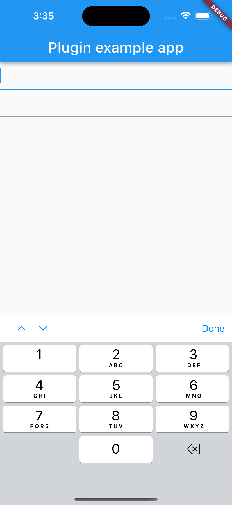
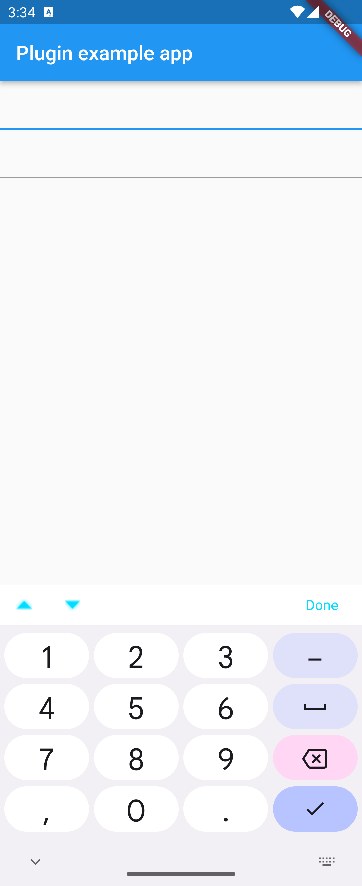

# keyboard_action

* [](https://pub.dev/packages/keyboard_action)
[](https://github.com/ho-doan/keyboard_action)
[](https://github.com/ho-doan/keyboard_action)
[](https://github.com/ho-doan/keyboard_action)
* Bluetooth Low Energy (BLE) plugin that can communicate with single device

# Demo




## Futures

- Add sub view keyboard

## Getting Started

### android

#### Android ProGuard rules

```txt
-keep class com.hodoan.keyboard_action.** { *; }
```

### Usage

#### Scan Device

```dart
TextFormFieldCustomKeyboard(
    controller: TextEditingController(),
),
```